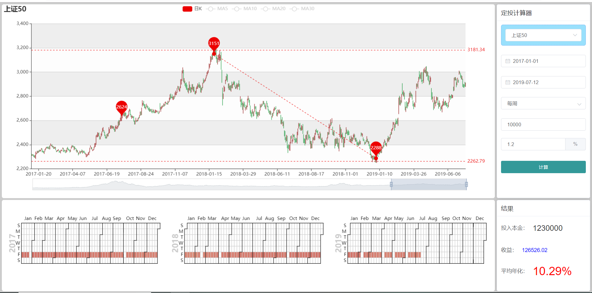
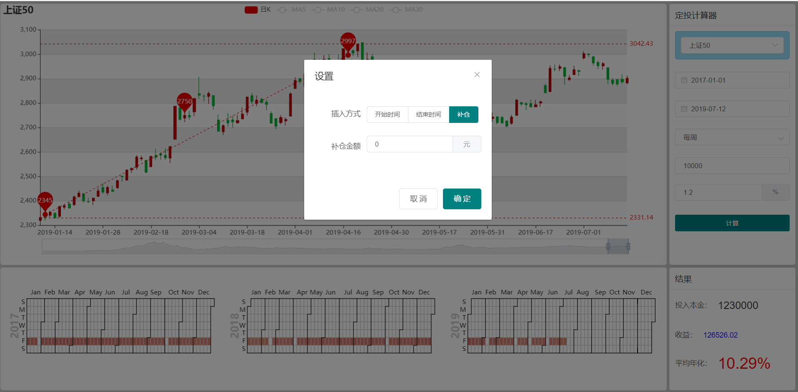

# 一款简单的基金定投计算器

`vue+elmentUi+typescript+echart`实现的一款简单的基金定投工具；
最近关注一些理财的东西，对于我这种没什么经验的理财小白，定投基金可能是比较好的选择，但当我在研究不同时段定投不同指数收益情况时，发现网上能找到的定投工具都不是很好用，第一不是很直观，第二不能补仓(这款工具点击K线可以调整时间，及补仓)；所以就开发这款自己用着还算顺手的定投指数计算器。
PS：这只是一款研究定投的小工具，计算可能不是准确（费率什么的简化了）;只供研究学习指数定投；





## 依赖安装
```
npm install
```

### 开发运行
```
npm run serve
```
### 打包
```
npm run build
```


